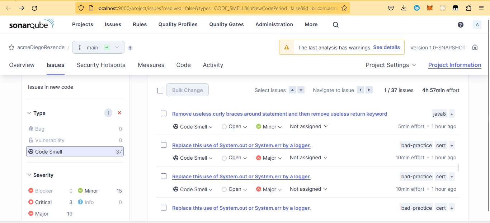

# Primeira Análise Sonarqube

**Principais alertas:**

- Replace this use of System.out or System.err by a logger.
- Refactor this code to use the more specialised Functional Interface 'UnaryOperator<List>'
- Remove useless curly braces around statement and then remove useless return keyword
- Define a constant instead of duplicating this literal.

